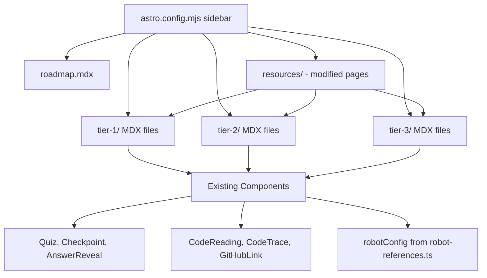

# Design Document: Leveled Training Program

## Overview

This design expands the FRC Programming Training Site from a four-unit core curriculum into a full multi-level training program with three tiers of structured lessons and activities. The new content lives alongside the existing Units 0–3 in the Astro Starlight site, following the same MDX patterns, interactive components, and pedagogical approach already established.

The feature is primarily a content architecture and authoring effort. No new React components, data schemas, or build tooling are required. The work consists of:

1. Creating ~30 new MDX content files across three tier directories
2. Updating `astro.config.mjs` sidebar configuration with three new groups
3. Modifying three existing resource pages to cross-link to tier content
4. Adding a weekly roadmap page
5. Extending the glossary with new terms introduced in Tier 2 and Tier 3

The design prioritizes consistency with existing patterns — every new file uses the same frontmatter structure, component imports, and pedagogical flow (learning objectives → content → interactive exercises → checkpoint → what's next) that students already know from Units 0–3.

## Architecture

### Content Directory Layout

New content lives in three directories under `src/content/docs/`:

```
src/content/docs/
├── tier-1/          # Beginner lessons and activities
├── tier-2/          # Intermediate lessons and activities
├── tier-3/          # Advanced lessons and activities
├── roadmap.mdx      # Weekly pacing guide (top-level page)
├── resources/       # Existing — modified to cross-link
├── reference-sheets/# Existing — glossary extended
├── unit-0/          # Existing — unchanged
├── unit-1/          # Existing — unchanged
├── unit-2/          # Existing — unchanged
└── unit-3/          # Existing — unchanged
```

### Sidebar Structure

The sidebar in `astro.config.mjs` gains three new groups inserted after Unit 3 and before Reference Sheets, plus a roadmap link:

```
Welcome
Unit 0: Prerequisites
Unit 1: Orientation
Unit 2: Core Flow
Unit 3: Safe Contribution
─── NEW ───
Weekly Roadmap
🟢 Tier 1: Beginner
🟡 Tier 2: Intermediate
🔴 Tier 3: Advanced
─── EXISTING ───
Reference Sheets
Resources
Instructors
```

### No Schema or Component Changes

- `src/content.config.ts` uses Starlight's `docsSchema()` with no custom fields — new MDX files work automatically
- All six existing components (Quiz, Checkpoint, AnswerReveal, CodeReading, CodeTrace, GitHubLink) are reused as-is
- `src/config/robot-references.ts` is used as-is for team-specific code links



## Components and Interfaces

### Existing Components (Reused, No Changes)

| Component | Props | Usage in New Content |
|-----------|-------|---------------------|
| `Quiz` | `question`, `options[]`, `correctIndex`, `explanation` | Vocabulary quizzes, concept checks in every lesson |
| `Checkpoint` | `title`, `prompt`, `children` | Self-assessment at end of each lesson/activity |
| `AnswerReveal` | `label?`, `children` | Inline answer reveals in activities |
| `CodeReading` | `targetFile`, `answers?` | Five-question framework exercises in Tier 1 and Tier 2 |
| `CodeTrace` | `title`, `steps[]`, `startAction`, `endResult` | Execution path traces in Tier 1 and Tier 2 |
| `GitHubLink` | `path`, `startLine?`, `endLine?`, `label?`, `isFolder?` | Links to team code in all tiers via `robotConfig` |

### Sidebar Configuration Interface

The sidebar update in `astro.config.mjs` adds three new group objects and one link to the existing `sidebar` array. Each group follows the existing Starlight sidebar pattern:

```javascript
{
  label: '🟢 Tier 1: Beginner',
  items: [
    { label: 'Lesson title', link: '/tier-1/slug' },
    // ...
  ],
}
```

### Resource Page Modification Interface

Each existing resource page (`beginner.mdx`, `intermediate.mdx`, `advanced.mdx`) gets a Starlight `:::note` callout block inserted after the frontmatter and before the first heading, linking to the corresponding tier.

### Vocabulary Reinforcement Interface

Vocabulary reinforcement uses three mechanisms already available in MDX/Starlight:

1. **Inline definitions**: Bold term + parenthetical definition on first use, e.g., `**Odometry** (tracking the robot's position using wheel encoders and gyro data)`
2. **Glossary links**: Standard markdown links to `/reference-sheets/glossary`, e.g., `[Odometry](/reference-sheets/glossary)`
3. **Key Terms section**: A markdown table at the end of each lesson listing terms introduced in that lesson

No new components are needed for any of these.

## Data Models

### MDX Frontmatter Schema

All new files use the standard Starlight `docsSchema()` frontmatter. No custom fields are added.

```yaml
---
title: "Lesson X.Y: Title"
description: "One-line description"
sidebar:
  order: N    # Controls ordering within the sidebar group
prev: true    # Enables previous page link
next: true    # Enables next page link
---
```

### Content File Naming Convention

Files follow the existing pattern: `{type}-{number}-{slug}.mdx`

- Lessons: `lesson-{tier}.{seq}-{slug}.mdx` (e.g., `lesson-1.1-wpilib-deep-dive.mdx`)
- Activities: `activity-{tier}.{seq}-{slug}.mdx` (e.g., `activity-1.2-explore-your-code.mdx`)

The tier number prefix in the lesson/activity number (1.x, 2.x, 3.x) matches the tier directory, keeping numbering unambiguous across the site.

### Lesson and Activity Content Files

Below is the complete list of MDX files to create, organized by tier. Each entry shows the filename, title, and which requirements it addresses.


#### Tier 1: Beginner (`src/content/docs/tier-1/`)

| # | File | Title | Description | Req |
|---|------|-------|-------------|-----|
| 1 | `lesson-1.1-wpilib-deep-dive.mdx` | WPILib Documentation Deep Dive | Navigate WPILib docs effectively; Zero to Robot, command-based index, API javadocs | 1 |
| 2 | `activity-1.2-explore-your-code.mdx` | Explore Your Own Robot Code | Code Reading exercises on 3 files students haven't opened; use CodeReading component | 1 |
| 3 | `lesson-1.3-java-patterns-frc.mdx` | Java Patterns in FRC Code | Lambdas, method references, enums, static final, inheritance, interfaces as seen in team code | 10 |
| 4 | `activity-1.4-find-java-patterns.mdx` | Find Java Patterns in Your Code | Students locate and document one example of each Java pattern in the team repo | 10 |
| 5 | `lesson-1.5-constants-subsystems-commands.mdx` | Constants, Subsystems & Commands Revisited | Deeper dive into the three building blocks, building on Units 2–3 | 1 |
| 6 | `activity-1.6-trace-a-new-button.mdx` | Trace a New Button | Students pick an untraced button binding and produce a full CodeTrace | 1 |
| 7 | `lesson-1.7-networktables.mdx` | NetworkTables Basics | Publish/subscribe model, SmartDashboard methods, Limelight data flow, auto chooser | 11 |
| 8 | `activity-1.8-explore-networktables.mdx` | Explore Live NetworkTables | Use OutlineViewer or AdvantageScope NT viewer to document live entries | 11 |
| 9 | `lesson-1.9-game-manual-for-programmers.mdx` | FRC Game Manual for Programmers | Control system rules, autonomous constraints, safety rules relevant to code | 1 |
| 10 | `lesson-1.10-git-workflow.mdx` | Git & GitHub Team Workflow | Branching strategy, pull requests, code review, merge conflicts | 1 |
| 11 | `activity-1.11-git-pr-exercise.mdx` | Create a Pull Request | Students create a branch, make a safe edit, open a PR, and request review | 1 |
| 12 | `lesson-1.12-auto-reading.mdx` | Reading Autonomous Routines | Read PathPlanner JSON files, identify paths and Named_Commands in existing autos | 9 |
| 13 | `activity-1.13-read-an-auto.mdx` | Read an Auto Routine | Open PathPlanner GUI, load team project, trace an existing auto routine | 9 |

#### Tier 2: Intermediate (`src/content/docs/tier-2/`)

| # | File | Title | Description | Req |
|---|------|-------|-------------|-----|
| 1 | `lesson-2.1-chief-delphi.mdx` | Chief Delphi as a Learning Resource | How to search, read build threads, find programming discussions | 2 |
| 2 | `lesson-2.2-reading-top-team-code.mdx` | Reading Top Team Code | How to navigate 254, 6328, 971, 1678 repos; what to look for | 2 |
| 3 | `activity-2.3-compare-subsystem.mdx` | Compare a Subsystem | Comparison_Exercise: pick a subsystem in a top team repo, compare to team's equivalent | 2, 8 |
| 4 | `lesson-2.4-debugging-with-data.mdx` | Debugging with Shuffleboard & AdvantageScope | Logging values, reading graphs, replaying matches | 2 |
| 5 | `lesson-2.5-vendor-docs-deep-dive.mdx` | Vendor Documentation Deep Dive | Phoenix 6 and REV deeper features, reading API docs, finding examples | 2 |
| 6 | `activity-2.6-vendor-example.mdx` | Use a Vendor Example | Students find and adapt a vendor example project for a team mechanism | 2 |
| 7 | `lesson-2.7-deploy-test-debug.mdx` | Deploying and Testing on the Robot | gradlew deploy, Driver_Station, enabling, troubleshooting | 12 |
| 8 | `activity-2.8-deploy-test-fix.mdx` | Deploy-Test-Fix Cycle | Practice deploying with an intentional issue, diagnose via DS output, fix | 12 |
| 9 | `lesson-2.9-can-bus-debugging.mdx` | CAN Bus and Hardware Debugging | CAN architecture, Phoenix Tuner X, REV Hardware Client, DS error messages | 13 |
| 10 | `activity-2.10-inspect-can-devices.mdx` | Inspect CAN Devices | Use diagnostic tools to document status of each CAN device on the robot | 13 |
| 11 | `lesson-2.11-swerve-concepts.mdx` | Swerve Drive Concepts | Module states, field-relative vs robot-relative, odometry, kinematics, gyro | 14 |
| 12 | `activity-2.12-trace-swerve-input.mdx` | Trace a Joystick Through Swerve Math | Trace joystick input → kinematics → module states using team's drivetrain code | 14 |
| 13 | `lesson-2.13-pathplanner-create.mdx` | Creating Paths and Named Commands | PathPlanner GUI path creation, registering Named_Commands, event markers, constraints | 9 |
| 14 | `activity-2.14-build-an-auto.mdx` | Build an Auto Routine | Create a path, register a Named_Command, compose an auto, verify in chooser | 9 |
| 15 | `activity-2.15-compare-auto-routines.mdx` | Compare Auto Routines | Comparison_Exercise: compare team's auto structure to a top team's approach | 8, 9 |

#### Tier 3: Advanced (`src/content/docs/tier-3/`)

| # | File | Title | Description | Req |
|---|------|-------|-------------|-----|
| 1 | `lesson-3.1-advantagekit.mdx` | AdvantageKit Logging and Replay | IO abstraction, structured logging, replay debugging | 3 |
| 2 | `activity-3.2-replay-a-match.mdx` | Replay a Match | Add logging to one subsystem, replay match data in AdvantageScope | 3 |
| 3 | `lesson-3.3-simulation.mdx` | Simulation Tools | WPILib simulation, physics sim, Glass/Shuffleboard in sim mode | 3 |
| 4 | `activity-3.4-simulate-an-auto.mdx` | Simulate an Auto Routine | Run a PathPlanner auto in simulation without a physical robot | 3 |
| 5 | `lesson-3.5-control-theory.mdx` | Control Theory: PID, Feedforward, Motion Profiling | PID terms, feedforward, TrapezoidProfile, Motion Magic | 3 |
| 6 | `activity-3.6-tune-a-pid.mdx` | Tune a PID Loop | Pick a mechanism, tune PID using AdvantageScope data | 3 |
| 7 | `lesson-3.7-vision-processing.mdx` | Vision Processing | AprilTag pose estimation, multi-camera fusion, latency compensation | 3 |
| 8 | `lesson-3.8-pose-estimation.mdx` | Pose Estimation and Localization | Odometry drift, Kalman filter intuition, standard deviations, vision fusion | 15 |
| 9 | `activity-3.9-analyze-pose-data.mdx` | Analyze Pose Estimator Data | Review match logs, evaluate pose accuracy, suggest SD tuning changes | 15 |
| 10 | `lesson-3.10-state-machines.mdx` | State Machines | States, transitions, guards; AutoShootCommand as implicit SM; enum+switch pattern; superstructure | 16 |
| 11 | `activity-3.11-design-state-machine.mdx` | Design a State Machine | Refactor a command sequence into an explicit state machine or design a new one | 16 |
| 12 | `activity-3.12-compare-state-machines.mdx` | Compare State Machine Implementations | Comparison_Exercise: examine a top team's SM and compare to team's command structure | 8, 16 |
| 13 | `lesson-3.13-unit-testing.mdx` | Unit Testing Robot Code | JUnit with WPILib sim harness, testing commands, math utilities, state machines | 3 |
| 14 | `activity-3.14-write-a-test.mdx` | Write a Unit Test | Write a JUnit test for a command or utility in the team's code | 3 |
| 15 | `lesson-3.15-architecture-patterns.mdx` | Architecture Patterns from Top Teams | IO layers, superstructure, trigger-based, singleton patterns | 3 |
| 16 | `lesson-3.16-pathplanner-advanced.mdx` | Advanced PathPlanner | On-the-fly generation, path constraints, zone behavior, AutoBuilder composition | 9 |
| 17 | `activity-3.17-advanced-auto.mdx` | Implement an Advanced Auto Feature | On-the-fly path gen, custom constraints, or AutoBuilder composition in team code | 9 |
| 18 | `activity-3.18-iterate-auto.mdx` | Test and Iterate an Auto | Run, observe, adjust waypoints/timing, re-test cycle in sim or on robot | 9 |
| 19 | `lesson-3.19-competition-readiness.mdx` | Competition Readiness | Pre-match checklist, pit debugging flowchart, match log analysis, hotfix branches | 17 |
| 20 | `activity-3.20-competition-debug-sim.mdx` | Simulated Competition Debugging | Time-pressured debugging scenario: diagnose and fix within a fixed time limit | 17 |
| 21 | `activity-3.21-compare-drivetrain.mdx` | Compare Drivetrain Implementations | Comparison_Exercise: compare team's CommandSwerveDrivetrain to a top team's | 8 |

#### Other Files

| File | Location | Description | Req |
|------|----------|-------------|-----|
| `roadmap.mdx` | `src/content/docs/roadmap.mdx` | Weekly pacing guide for the FRC season | 7 |

### Total File Count

- Tier 1: 13 files (7 lessons, 6 activities)
- Tier 2: 15 files (7 lessons, 8 activities)
- Tier 3: 21 files (9 lessons, 12 activities)
- Other: 1 file (roadmap)
- Modified: 3 files (resource pages)
- **Total new: 50 MDX files**
- **Total modified: 4 files** (3 resource pages + `astro.config.mjs`)


### Content Template Pattern

Every lesson and activity MDX file follows a standard template. This ensures consistency with the existing Core Curriculum (Req 5).

#### Lesson Template

```mdx
---
title: "Lesson X.Y: Title"
description: "One-line description"
sidebar:
  order: N
prev: true
next: true
---

import { Quiz } from '../../../components/Quiz';
import { Checkpoint } from '../../../components/Checkpoint';
import { AnswerReveal } from '../../../components/AnswerReveal';
import { CodeReading } from '../../../components/CodeReading';
import { GitHubLink } from '../../../components/GitHubLink';
import { robotConfig } from '../../../config/robot-references';

## 🎯 What You'll Learn

By the end of this lesson you will be able to:
- Learning objective 1
- Learning objective 2
- Learning objective 3

:::tip[Before You Start]
Prerequisites: what the student should have completed before this lesson.
:::

---

[Main content sections with code examples, explanations,
Quiz and Checkpoint components, GitHubLink references]

---

## Key Terms

| Term | Definition |
|------|-----------|
| **Term 1** | Definition linking to [glossary](/reference-sheets/glossary) |
| **Term 2** | Definition |

---

## What's Next?

Brief description of the next lesson/activity and how it builds on this one.
```

#### Activity Template

```mdx
---
title: "Activity X.Y: Title"
description: "One-line description"
sidebar:
  order: N
prev: true
next: true
---

import { Checkpoint } from '../../../components/Checkpoint';
import { AnswerReveal } from '../../../components/AnswerReveal';
import { GitHubLink } from '../../../components/GitHubLink';
import { robotConfig } from '../../../config/robot-references';

## 🎯 Goal

By the end of this activity you will have:
- Concrete outcome 1
- Concrete outcome 2

:::tip[Before You Start]
Prerequisites and what to have open/ready.
:::

---

[Step-by-step instructions with numbered steps,
code snippets, GitHubLink references to team code,
Checkpoint components for self-assessment]

---

## What's Next?

Brief description of the next content page.
```

### Sidebar Configuration Changes

The `astro.config.mjs` sidebar array is updated to insert the new groups. The exact insertion point is after the "Unit 3: Safe Contribution" group and before the "Reference Sheets" group.

```javascript
// After Unit 3 group, add:
{
  label: '📅 Weekly Roadmap',
  link: '/roadmap',
},
{
  label: '🟢 Tier 1: Beginner',
  items: [
    { label: 'Lesson 1.1: WPILib Deep Dive', link: '/tier-1/lesson-11-wpilib-deep-dive' },
    { label: 'Activity 1.2: Explore Your Code', link: '/tier-1/activity-12-explore-your-code' },
    { label: 'Lesson 1.3: Java Patterns in FRC', link: '/tier-1/lesson-13-java-patterns-frc' },
    { label: 'Activity 1.4: Find Java Patterns', link: '/tier-1/activity-14-find-java-patterns' },
    { label: 'Lesson 1.5: Constants, Subsystems & Commands', link: '/tier-1/lesson-15-constants-subsystems-commands' },
    { label: 'Activity 1.6: Trace a New Button', link: '/tier-1/activity-16-trace-a-new-button' },
    { label: 'Lesson 1.7: NetworkTables Basics', link: '/tier-1/lesson-17-networktables' },
    { label: 'Activity 1.8: Explore NetworkTables', link: '/tier-1/activity-18-explore-networktables' },
    { label: 'Lesson 1.9: Game Manual for Programmers', link: '/tier-1/lesson-19-game-manual-for-programmers' },
    { label: 'Lesson 1.10: Git Workflow', link: '/tier-1/lesson-110-git-workflow' },
    { label: 'Activity 1.11: Create a Pull Request', link: '/tier-1/activity-111-git-pr-exercise' },
    { label: 'Lesson 1.12: Reading Auto Routines', link: '/tier-1/lesson-112-auto-reading' },
    { label: 'Activity 1.13: Read an Auto', link: '/tier-1/activity-113-read-an-auto' },
  ],
},
{
  label: '🟡 Tier 2: Intermediate',
  items: [
    { label: 'Lesson 2.1: Chief Delphi', link: '/tier-2/lesson-21-chief-delphi' },
    { label: 'Lesson 2.2: Reading Top Team Code', link: '/tier-2/lesson-22-reading-top-team-code' },
    { label: 'Activity 2.3: Compare a Subsystem', link: '/tier-2/activity-23-compare-subsystem' },
    { label: 'Lesson 2.4: Debugging with Data', link: '/tier-2/lesson-24-debugging-with-data' },
    { label: 'Lesson 2.5: Vendor Docs Deep Dive', link: '/tier-2/lesson-25-vendor-docs-deep-dive' },
    { label: 'Activity 2.6: Use a Vendor Example', link: '/tier-2/activity-26-vendor-example' },
    { label: 'Lesson 2.7: Deploy, Test, Debug', link: '/tier-2/lesson-27-deploy-test-debug' },
    { label: 'Activity 2.8: Deploy-Test-Fix Cycle', link: '/tier-2/activity-28-deploy-test-fix' },
    { label: 'Lesson 2.9: CAN Bus & Hardware Debugging', link: '/tier-2/lesson-29-can-bus-debugging' },
    { label: 'Activity 2.10: Inspect CAN Devices', link: '/tier-2/activity-210-inspect-can-devices' },
    { label: 'Lesson 2.11: Swerve Drive Concepts', link: '/tier-2/lesson-211-swerve-concepts' },
    { label: 'Activity 2.12: Trace Swerve Input', link: '/tier-2/activity-212-trace-swerve-input' },
    { label: 'Lesson 2.13: Creating Paths & Named Commands', link: '/tier-2/lesson-213-pathplanner-create' },
    { label: 'Activity 2.14: Build an Auto Routine', link: '/tier-2/activity-214-build-an-auto' },
    { label: 'Activity 2.15: Compare Auto Routines', link: '/tier-2/activity-215-compare-auto-routines' },
  ],
},
{
  label: '🔴 Tier 3: Advanced',
  items: [
    { label: 'Lesson 3.1: AdvantageKit', link: '/tier-3/lesson-31-advantagekit' },
    { label: 'Activity 3.2: Replay a Match', link: '/tier-3/activity-32-replay-a-match' },
    { label: 'Lesson 3.3: Simulation', link: '/tier-3/lesson-33-simulation' },
    { label: 'Activity 3.4: Simulate an Auto', link: '/tier-3/activity-34-simulate-an-auto' },
    { label: 'Lesson 3.5: Control Theory', link: '/tier-3/lesson-35-control-theory' },
    { label: 'Activity 3.6: Tune a PID Loop', link: '/tier-3/activity-36-tune-a-pid' },
    { label: 'Lesson 3.7: Vision Processing', link: '/tier-3/lesson-37-vision-processing' },
    { label: 'Lesson 3.8: Pose Estimation', link: '/tier-3/lesson-38-pose-estimation' },
    { label: 'Activity 3.9: Analyze Pose Data', link: '/tier-3/activity-39-analyze-pose-data' },
    { label: 'Lesson 3.10: State Machines', link: '/tier-3/lesson-310-state-machines' },
    { label: 'Activity 3.11: Design a State Machine', link: '/tier-3/activity-311-design-state-machine' },
    { label: 'Activity 3.12: Compare State Machines', link: '/tier-3/activity-312-compare-state-machines' },
    { label: 'Lesson 3.13: Unit Testing', link: '/tier-3/lesson-313-unit-testing' },
    { label: 'Activity 3.14: Write a Test', link: '/tier-3/activity-314-write-a-test' },
    { label: 'Lesson 3.15: Architecture Patterns', link: '/tier-3/lesson-315-architecture-patterns' },
    { label: 'Lesson 3.16: Advanced PathPlanner', link: '/tier-3/lesson-316-pathplanner-advanced' },
    { label: 'Activity 3.17: Advanced Auto Feature', link: '/tier-3/activity-317-advanced-auto' },
    { label: 'Activity 3.18: Iterate an Auto', link: '/tier-3/activity-318-iterate-auto' },
    { label: 'Lesson 3.19: Competition Readiness', link: '/tier-3/lesson-319-competition-readiness' },
    { label: 'Activity 3.20: Competition Debug Sim', link: '/tier-3/activity-320-competition-debug-sim' },
    { label: 'Activity 3.21: Compare Drivetrains', link: '/tier-3/activity-321-compare-drivetrain' },
  ],
},
// Then existing Reference Sheets, Resources, Instructors groups follow
```


### Resource Page Modifications

Each resource page gets a callout block added after the frontmatter imports and before the first `##` heading (Req 6).

**beginner.mdx** — Add after frontmatter:
```mdx
:::note[📚 Structured Lessons Available]
Looking for step-by-step lessons? The [Tier 1: Beginner](/tier-1/lesson-11-wpilib-deep-dive) section has structured lessons and hands-on activities that build on the core curriculum. The resources below are curated external links that complement those lessons.
:::
```

**intermediate.mdx** — Add after frontmatter:
```mdx
:::note[📚 Structured Lessons Available]
Looking for guided learning? The [Tier 2: Intermediate](/tier-2/lesson-21-chief-delphi) section has structured lessons and hands-on activities covering these topics in depth. The resources below are curated external links that complement those lessons.
:::
```

**advanced.mdx** — Add after frontmatter:
```mdx
:::note[📚 Structured Lessons Available]
Ready for structured challenges? The [Tier 3: Advanced](/tier-3/lesson-31-advantagekit) section has in-depth lessons and hands-on activities. The resources below are curated external links that complement those lessons.
:::
```

### Weekly Roadmap Page

`src/content/docs/roadmap.mdx` provides a suggested pacing guide (Req 7.4). Structure:

```mdx
---
title: "📅 Weekly Roadmap"
description: "Suggested pacing guide for the FRC season"
sidebar:
  order: 0
prev: true
next: true
---

## How to Use This Roadmap

[Brief explanation: this is a suggestion, not a requirement. Teams adapt to their schedule.]

## Pre-Season (Weeks 1–4)
- Complete Core Curriculum (Units 0–3)
- Start Tier 1 lessons

## Build Season (Weeks 5–10)
- Complete Tier 1
- Begin Tier 2 (deploy/test, CAN bus, swerve concepts)

## Competition Prep (Weeks 11–14)
- Tier 2 completion (PathPlanner, debugging)
- Start Tier 3 (competition readiness, pose estimation)

## Competition Season (Weeks 15+)
- Tier 3 as needed (match log analysis, hotfix branches)
- Reference competition readiness lesson before each event

## Off-Season
- Remaining Tier 3 (AdvantageKit, simulation, architecture patterns)
- Comparison exercises with top team code
```

### Vocabulary Reinforcement Approach

Vocabulary reinforcement is implemented through content authoring conventions, not code changes (Req 18):

1. **First use in a lesson**: Bold the term and provide a parenthetical definition inline. Example: `**Odometry** (tracking the robot's position using wheel encoders and gyro data) is how the robot knows where it is on the field.`

2. **Subsequent uses in the same lesson**: Link to the glossary. Example: `The [odometry](/reference-sheets/glossary) data feeds into the pose estimator.`

3. **Key Terms section**: Every lesson ends with a "Key Terms" table before the "What's Next" section. This lists all terms introduced in that lesson with brief definitions.

4. **Vocabulary Quiz/Checkpoint**: Each tier includes at least one Quiz or Checkpoint that tests vocabulary. These are embedded in the lessons where the terms are taught.

5. **Building on prior vocabulary**: Tier 2 and Tier 3 lessons reference previously defined terms before extending them. Example: "You learned about **subsystems** in Unit 2 as the code that controls hardware. In Tier 2, we'll look at how top teams structure their subsystems differently."

6. **Glossary extension**: The existing `glossary.mdx` table is extended with new terms introduced in Tier 2 and Tier 3 (e.g., Odometry, Kinematics, Kalman Filter, State Machine, Superstructure Pattern).

### Comparison Exercise Structure

Comparison exercises (Req 8) follow a consistent format embedded in activity MDX files:

```mdx
## 🔍 Comparison Exercise: [Topic]

**Team to study:** [Team name and number]
**Repository:** [GitHub URL]
**File/folder to examine:** [Specific path]

### Guiding Questions
1. [Specific question about structure]
2. [Specific question about patterns]
3. [Question comparing to team's code]

### Document Your Findings

| Aspect | Their Team | Our Team | Why the Difference? |
|--------|-----------|----------|-------------------|
| [Aspect 1] | | | |
| [Aspect 2] | | | |
```

The three required comparison exercises (Req 8.1) are:
1. **Activity 2.3**: Compare a subsystem (any subsystem, student's choice)
2. **Activity 2.15**: Compare auto routine structure
3. **Activity 3.21**: Compare drivetrain implementations (CommandSwerveDrivetrain vs top team)

Additional comparison exercises appear in:
4. **Activity 3.12**: Compare state machine implementations

### Prerequisites Display

Each tier's first lesson includes a prerequisites callout (Req 7):

- **Tier 1 first lesson** (`lesson-1.1`): "Complete Units 0–3 (Core Curriculum) before starting Tier 1."
- **Tier 2 first lesson** (`lesson-2.1`): "Complete Units 0–3 and Tier 1 before starting Tier 2."
- **Tier 3 first lesson** (`lesson-3.1`): "Complete Tier 2 before starting Tier 3."

Subsequent lessons within a tier use the standard `:::tip[Before You Start]` pattern referencing the previous lesson in the tier.


## Correctness Properties

*A property is a characteristic or behavior that should hold true across all valid executions of a system — essentially, a formal statement about what the system should do. Properties serve as the bridge between human-readable specifications and machine-verifiable correctness guarantees.*

### Property 1: Lesson structural completeness

*For any* MDX file in `tier-1/`, `tier-2/`, or `tier-3/` whose filename starts with `lesson-`, the file SHALL contain: (a) valid frontmatter with `title`, `description`, `sidebar.order`, `prev`, and `next` fields, (b) a "What You'll Learn" section, (c) at least one `Quiz` or `Checkpoint` component usage, and (d) a "What's Next" section.

**Validates: Requirements 1.3, 2.3, 3.3, 5.1, 5.3, 5.4**

### Property 2: Activity structural completeness

*For any* MDX file in `tier-1/`, `tier-2/`, or `tier-3/` whose filename starts with `activity-`, the file SHALL contain: (a) valid frontmatter with `title`, `description`, `sidebar.order`, `prev`, and `next` fields, (b) a "Goal" section, (c) numbered step-by-step instructions, and (d) a "What's Next" section.

**Validates: Requirements 1.4, 2.4, 3.4, 5.1, 5.3, 5.4**

### Property 3: Team code references use robotConfig and GitHubLink

*For any* new MDX content file that references the team's robot code, the file SHALL import `robotConfig` from `../../../config/robot-references` and use the `GitHubLink` component to generate links rather than hardcoding GitHub URLs.

**Validates: Requirements 1.5, 5.2, 5.5, 9.9**

### Property 4: Content files reside in correct tier directories

*For any* new content file belonging to Tier N, the file SHALL be located in `src/content/docs/tier-{N}/` and its filename SHALL follow the pattern `{lesson|activity}-{N}.{seq}-{slug}.mdx`.

**Validates: Requirements 4.6**

### Property 5: Sidebar preserves existing groups

*For any* existing sidebar group (Unit 0, Unit 1, Unit 2, Unit 3, Reference Sheets, Resources, Instructors), the group SHALL remain present in the `astro.config.mjs` sidebar array with its original label, items, and relative ordering unchanged after the new tier groups are added.

**Validates: Requirements 4.3**

### Property 6: Sidebar tier groups contain all content entries

*For any* tier directory (`tier-1/`, `tier-2/`, `tier-3/`), the corresponding sidebar group in `astro.config.mjs` SHALL contain one labeled entry for every MDX file in that directory, and the entry's `link` value SHALL resolve to the correct content file.

**Validates: Requirements 1.1, 2.1, 3.1, 4.1, 4.2**

### Property 7: Topic coverage per tier

*For any* tier, the set of MDX files in that tier's directory SHALL include at least one file whose filename starts with `lesson-` and at least one whose filename starts with `activity-` for each topic area defined in the corresponding requirement (Req 1 for Tier 1, Req 2 for Tier 2, Req 3 for Tier 3).

**Validates: Requirements 1.2, 2.2, 3.2**

### Property 8: Resource pages cross-link to tiers and preserve existing content

*For any* existing resource page (`beginner.mdx`, `intermediate.mdx`, `advanced.mdx`), the modified page SHALL contain: (a) a callout or note block linking to the corresponding tier's first lesson, (b) explanatory text about the relationship between resources and tier content, and (c) all original content sections preserved without removal or reordering.

**Validates: Requirements 6.1, 6.2, 6.3**

### Property 9: Comparison exercises include required structure

*For any* MDX file containing a Comparison Exercise, the file SHALL include: (a) a specific GitHub repository URL, (b) a specific file or folder path to examine, (c) guiding questions for analysis, and (d) a structured table or format for documenting findings.

**Validates: Requirements 8.2**

### Property 10: Autonomous content spans all tiers

*For any* tier directory (`tier-1/`, `tier-2/`, `tier-3/`), there SHALL exist at least one MDX file whose content covers autonomous programming or PathPlanner topics.

**Validates: Requirements 9.1**

### Property 11: Autonomous lessons reference PathPlanner documentation

*For any* lesson MDX file covering autonomous or PathPlanner topics, the file SHALL contain a link to `pathplanner.dev`.

**Validates: Requirements 9.10**

### Property 12: Lessons include Key Terms section

*For any* MDX file in `tier-1/`, `tier-2/`, or `tier-3/` whose filename starts with `lesson-`, the file SHALL contain a "Key Terms" section listing vocabulary terms introduced in that lesson with their definitions.

**Validates: Requirements 18.6**


## Error Handling

This feature is primarily content authoring — there is no runtime application logic to handle errors. The relevant error conditions are build-time and authoring-time issues:

### Build Errors

| Error | Cause | Resolution |
|-------|-------|------------|
| MDX parse failure | Invalid frontmatter YAML, unclosed JSX tags, or malformed component props | Fix the MDX syntax; Astro build output shows the file and line |
| Missing component import | Using `<Quiz>` without importing it | Add the import statement matching the existing pattern |
| Sidebar link 404 | `link` value in `astro.config.mjs` doesn't match the file's URL slug | Verify the slug matches the filename (Starlight derives slugs from filenames) |
| Broken GitHubLink | `robotConfig.repoUrl` is empty or path doesn't exist | The GitHubLink component already handles missing `repoUrl` with a fallback `<span>` |

### Content Authoring Errors

| Error | Cause | Resolution |
|-------|-------|------------|
| Missing required section | Lesson lacks "What You'll Learn" or "Key Terms" | Property tests catch this; author adds the missing section |
| Wrong import path | Component imported from wrong relative path | Use the standard `../../../components/` pattern for tier content |
| Sidebar ordering conflict | Two files in the same tier have the same `sidebar.order` value | Assign unique sequential order values |
| Broken external URL | Linked external resource (Chief Delphi, vendor docs) returns 404 | Periodically verify external links; replace with updated URLs |

### No Runtime Error Handling Needed

Since this is a static site generated at build time, there are no runtime errors to handle. All content is pre-rendered to HTML. Component interactivity (Quiz, Checkpoint) is client-side React with self-contained state — no API calls, no server-side processing, no data persistence.

## Testing Strategy

### Dual Testing Approach

This feature requires both unit tests (specific examples and edge cases) and property-based tests (universal properties across all content files). Since the feature is content-heavy, tests focus on structural validation of MDX files and configuration correctness rather than application logic.

### Property-Based Testing

**Library:** [fast-check](https://github.com/dubzzz/fast-check) (already compatible with the project's Vitest setup)

**Configuration:** Each property test runs a minimum of 100 iterations. For content file validation, the "generated inputs" are the actual MDX files discovered on disk — the property must hold for every file in the set.

**Implementation approach:** Tests read the file system to discover all MDX files in `tier-1/`, `tier-2/`, `tier-3/`, then assert structural properties on each file's content. This is property-based in the sense that the property must hold *for all* files in the collection, not just specific examples.

Each property test is tagged with a comment referencing the design property:

```typescript
// Feature: leveled-training-program, Property 1: Lesson structural completeness
```

**Property tests to implement:**

| Property | What It Tests | Min Iterations |
|----------|--------------|----------------|
| Property 1 | Every lesson has frontmatter, learning objectives, interactive component, What's Next | 100 (or all lesson files) |
| Property 2 | Every activity has frontmatter, Goal section, numbered steps, What's Next | 100 (or all activity files) |
| Property 3 | Every file referencing team code uses robotConfig + GitHubLink imports | 100 (or all content files) |
| Property 4 | Every file is in the correct tier directory with correct naming | 100 (or all content files) |
| Property 5 | Existing sidebar groups preserved after modification | 1 (deterministic) |
| Property 6 | Every MDX file has a corresponding sidebar entry | 100 (or all content files) |
| Property 7 | Each tier has lesson + activity coverage for all topic areas | 1 per tier |
| Property 8 | Resource pages have callout + preserved content | 3 (one per page) |
| Property 9 | Comparison exercises have URL, path, questions, table | 100 (or all comparison files) |
| Property 10 | Each tier has at least one auto/PathPlanner file | 1 per tier |
| Property 11 | Auto lessons link to pathplanner.dev | 100 (or all auto lessons) |
| Property 12 | Every lesson has a Key Terms section | 100 (or all lesson files) |

### Unit Tests

Unit tests cover specific examples and edge cases that complement the property tests:

| Test | What It Verifies |
|------|-----------------|
| Sidebar ordering | Tier groups appear after Unit 3 and before Reference Sheets (Req 4.4) |
| Tier emoji labels | Sidebar labels contain 🟢, 🟡, 🔴 respectively (Req 4.5) |
| Roadmap file exists | `roadmap.mdx` exists with expected frontmatter (Req 7.4) |
| Comparison exercise count | At least 3 comparison exercises across Tier 2 and Tier 3 (Req 8.1) |
| Drivetrain comparison exists | At least one comparison exercise covers drivetrain (Req 8.3) |
| Auto comparison exists | At least one comparison exercise covers autonomous routines (Req 8.4) |
| Prerequisites in first lessons | First lesson of each tier contains prerequisites callout (Req 7.1) |
| Vocabulary quiz per tier | Each tier has at least one Quiz/Checkpoint testing vocabulary (Req 18.2) |

### Test File Organization

```
tests/
├── property/
│   ├── lesson-structure.test.ts    # Properties 1, 12
│   ├── activity-structure.test.ts  # Property 2
│   ├── team-code-refs.test.ts      # Property 3
│   ├── file-organization.test.ts   # Properties 4, 6, 10
│   ├── sidebar-integrity.test.ts   # Property 5
│   ├── resource-pages.test.ts      # Property 8
│   ├── comparison-exercises.test.ts# Property 9
│   └── auto-content.test.ts        # Property 11
└── unit/
    ├── sidebar-ordering.test.ts    # Sidebar position and emoji tests
    ├── roadmap.test.ts             # Roadmap existence test
    ├── comparison-count.test.ts    # Comparison exercise count tests
    ├── prerequisites.test.ts       # Prerequisites callout tests
    └── vocabulary.test.ts          # Vocabulary quiz per tier test
```

### What NOT to Test

- Content quality (pedagogical effectiveness, writing clarity) — requires human review
- External URL validity — requires network access, better handled by a link checker CI job
- Visual rendering — requires browser testing, not unit/property testable
- Component behavior (Quiz, Checkpoint interactivity) — already covered by existing component tests if any; not changed by this feature
